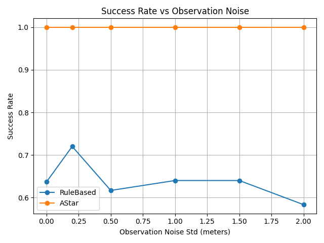
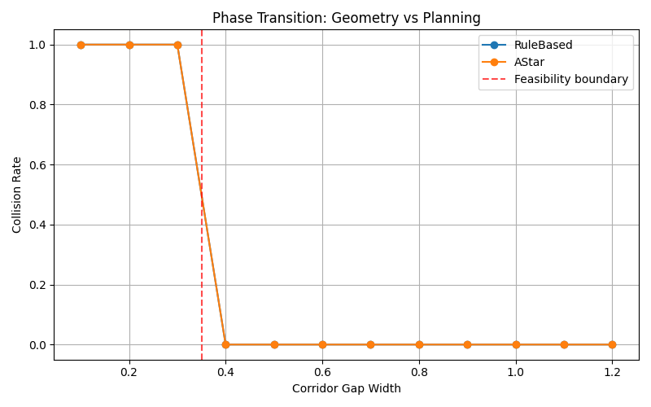
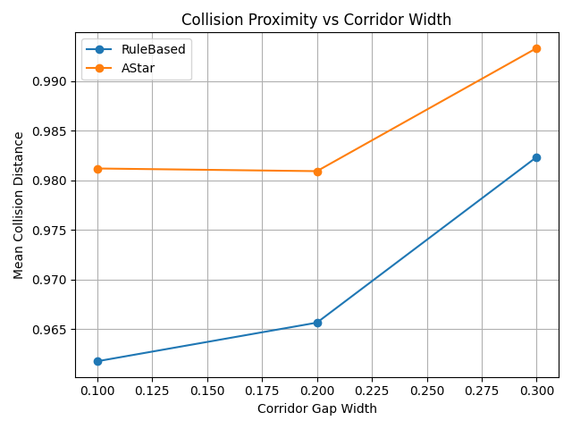
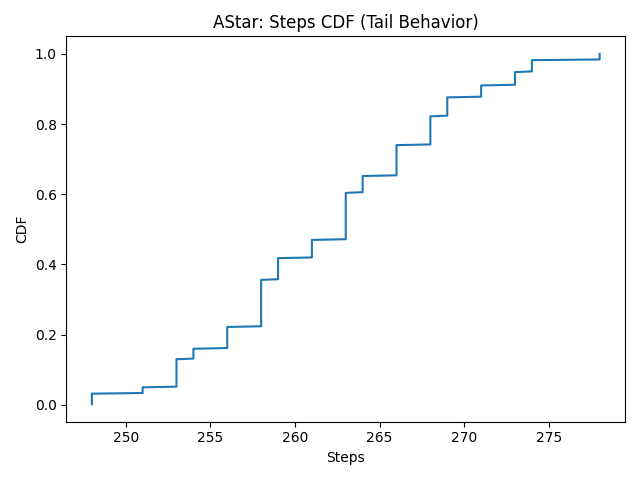

# Simulation-Based Planning Evaluation

This repository implements an **evaluation-first framework** for analyzing the safety, robustness, and failure modes of embodied planning agents in a continuous navigation environment.

Rather than optimizing for task success alone, the project focuses on **understanding when and why planners fail**, using adversarial geometry, risk-aware metrics, and structured failure analysis. The emphasis is on evaluation methodology and causal insight, not benchmark chasing.

---

## Motivation

Autonomous driving and embodied AI systems often fail not because of poor average performance, but due to **rare, structured, and safety-critical edge cases**.

This project explores the question:

> **When does planning stop being the bottleneck, and when do geometry and execution feasibility dominate failure?**

To answer this, planners are intentionally stressed using:
- Tight geometric constraints
- Observation noise
- Planning–control mismatch through tracking error

---

## System Overview

The framework consists of five core components:

### Simulator
Continuous 2D environment with velocity-based dynamics, collision checking, and goal conditions.

### Planners
- Rule-based reactive planner  
- Grid-based A* planner with global reasoning  

### Scenarios
<<<<<<< HEAD
Procedurally generated environments including adversarial obstacle layouts such as narrow corridors.

### Evaluation and Metrics
Risk-aware metrics including collision rate, success rate, step distributions, and conditional failure statistics.

### Analysis Pipeline
Failure taxonomy, robustness sweeps, risk reports, and distributional analysis.
=======
Procedurally generated environments including adversarial layouts such as **narrow corridors**.

### Evaluation and Metrics
Risk-aware metrics including:
- Collision rate
- Success rate
- Step distributions
- Conditional failure statistics
- Collision proximity at failure

### Analysis Pipeline
Failure taxonomy, robustness sweeps, phase transition analysis, and distributional risk reporting.
>>>>>>> 49e8eea (Finalize README with feasibility boundaries and planning-control mismatch analysis)

The system is intentionally modular to support controlled ablations and reproducibility.

---

## Key Experiments

### 1. Planner Comparison

Planners are evaluated across hundreds of randomized episodes under identical initial conditions.

Metrics include:
- Collision rate  
- Success rate  
- Mean and tail step counts  
- Conditional statistics given failure  

This reveals tradeoffs between **reactive efficiency** and **global planning guarantees**.

---

### 2. Robustness to Observation Noise

Observation noise is injected into the planner state.

<<<<<<< HEAD
Key findings:
- Reactive planners degrade gradually  
- Grid-based planners remain stable under moderate noise  
- Robustness plateaus once execution feasibility dominates  
=======
**Findings:**
- Reactive planners degrade gradually
- Grid-based planners remain stable under moderate noise
- Performance plateaus once execution feasibility dominates

**Collision Rate vs Noise**


**Success Rate vs Noise**

>>>>>>> 49e8eea (Finalize README with feasibility boundaries and planning-control mismatch analysis)

---

### 3. Adversarial Geometry: Corridor Feasibility Boundary

Corridor width is varied while holding planners and dynamics fixed.

<<<<<<< HEAD
Key observations:
- There exists a regime where **no planner succeeds**, regardless of optimality  
- Failures are dominated by early collisions caused by execution–planning mismatch  
- Global planning advantages vanish under untrackable geometric constraints  

This highlights the distinction between:
- **Feasible paths in configuration space**
- **Trackable trajectories under continuous dynamics**
=======
**Key observation:**
- Below a critical gap width (≈ 0.35), **all planners fail with probability 1**
- Above this threshold, **all planners succeed consistently**

This reveals a **sharp phase transition** where execution feasibility, not planning optimality, dominates failure.

**Phase Transition in Collision Probability**


---

### 4. Collision Proximity vs Corridor Width

Even when collisions are inevitable, planners fail at **different distances from obstacles**.

This measures **how close planners operate to feasibility limits**.

**Mean Collision Distance vs Corridor Width**


---

### 5. Planning–Control Mismatch via Tracking Error

Tracking noise is injected **after planning**, simulating controller error or actuation delay.

This isolates failures where:
- The planner produces a valid path
- The controller cannot safely execute it

**Key result:**
- Safety violations occur **despite correct planning**
- A second phase transition emerges due to execution limits

**Planning–Control Mismatch Phase Transition**


This directly mirrors a major root cause of real autonomous vehicle disengagements.

---

## Risk and Failure Distributions

Distributional analysis shows that failures are **structured rather than random**.

The A* planner exhibits tight step-count distributions, indicating predictable behavior until geometric or execution constraints dominate.

**A* Step Count CDF**

>>>>>>> 49e8eea (Finalize README with feasibility boundaries and planning-control mismatch analysis)

---

## Failure Taxonomy

Failures are explicitly classified into modes such as:

- `CollisionEarly`
- `CollisionLate`
- `TimeoutNoProgress`
- `Success`

A key result is the dominance of `CollisionEarly` in geometry-limited regimes, showing that failure occurs **before long-horizon planning becomes relevant**.

---

## Key Insights

<<<<<<< HEAD
- Planner optimality is subordinate to **geometric and execution feasibility** under tight constraints  
- Global planners can fail systematically due to **planning–control mismatch**  
- Average metrics hide critical structure in failure timing and mode  
- Evaluation-first design surfaces insights that performance-first benchmarks miss  
=======
- Planner optimality is subordinate to **geometric and execution feasibility**
- Global planners can fail systematically due to **planning–control mismatch**
- Average metrics hide critical structure in failure timing and mode
- Evaluation-first design exposes failure regimes missed by performance-only benchmarks
>>>>>>> 49e8eea (Finalize README with feasibility boundaries and planning-control mismatch analysis)

---

## Limitations and Future Work

This project intentionally does not implement:
<<<<<<< HEAD
- Kinodynamic or curvature-aware planning  
- Clearance-aware cost functions  
- Learned planners beyond a simple behavior-cloning baseline  

These are recognized as necessary extensions to overcome the identified failure regimes and are left as future work.

---

## Evaluation Results

### Robustness to Observation Noise

The following plots show collision rate and success rate as a function of observation noise.  
Despite increasing noise, planner behavior plateaus once execution feasibility dominates.

**Collision Rate vs Noise**  


**Success Rate vs Noise**  


---

### Risk and Failure Distributions

Distributional analysis reveals that failures are structured rather than random.

The A* planner exhibits tight step-count distributions, indicating predictable behavior until geometric or execution constraints dominate.

**A* Step Count CDF**  


---

## Geometric Feasibility Boundary

We vary corridor width while holding dynamics and planners fixed.

Below a critical gap width (≈ 0.35), **all planners fail with probability 1**, independent of planner optimality.  
Above this threshold, all planners succeed consistently.

This reveals a sharp **phase transition** where execution feasibility, not planning optimality, dominates failure.

**Phase Transition in Collision Probability**  


**Mean Collision Distance vs Corridor Width**  

=======
- Kinodynamic or curvature-aware planning
- Clearance-aware cost functions
- Full-stack learned planners

These are necessary extensions to overcome the identified failure regimes and are left as future work.
>>>>>>> 49e8eea (Finalize README with feasibility boundaries and planning-control mismatch analysis)

---

## Reproducibility

All experiments are reproducible using the provided scripts:

```bash
python -m experiments.run_batch
python -m experiments.sweep_noise
<<<<<<< HEAD
python -m analysis.run_failure_breakdown
python -m analysis.risk_report

python -m experiments.sweep_corridor_width
python -m analysis.plot_corridor_phase_transition
python -m analysis.plot_collision_distance_vs_gap
=======
python -m experiments.sweep_corridor_width
python -m experiments.sweep_tracking_error

python -m analysis.plot_corridor_phase_transition
python -m analysis.plot_collision_distance_vs_gap
python -m analysis.plot_tracking_error_phase_transition
python -m analysis.plot_risk_distributions

